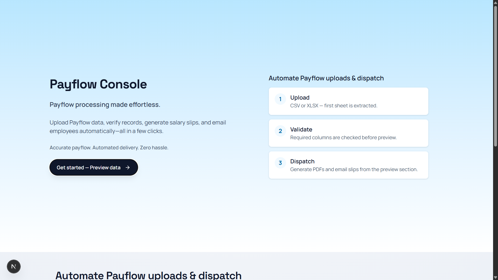
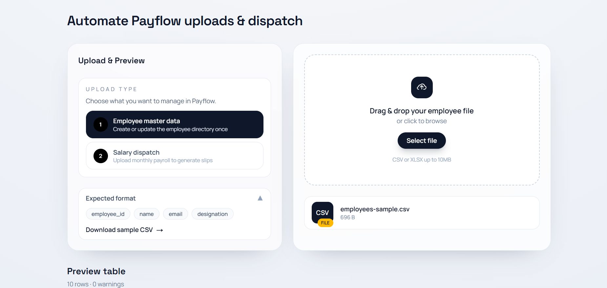
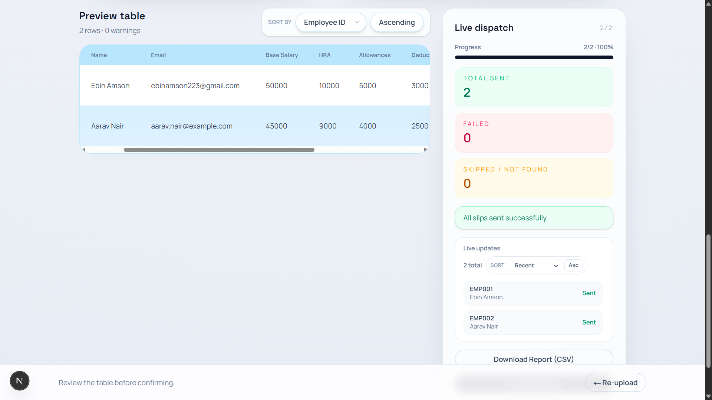
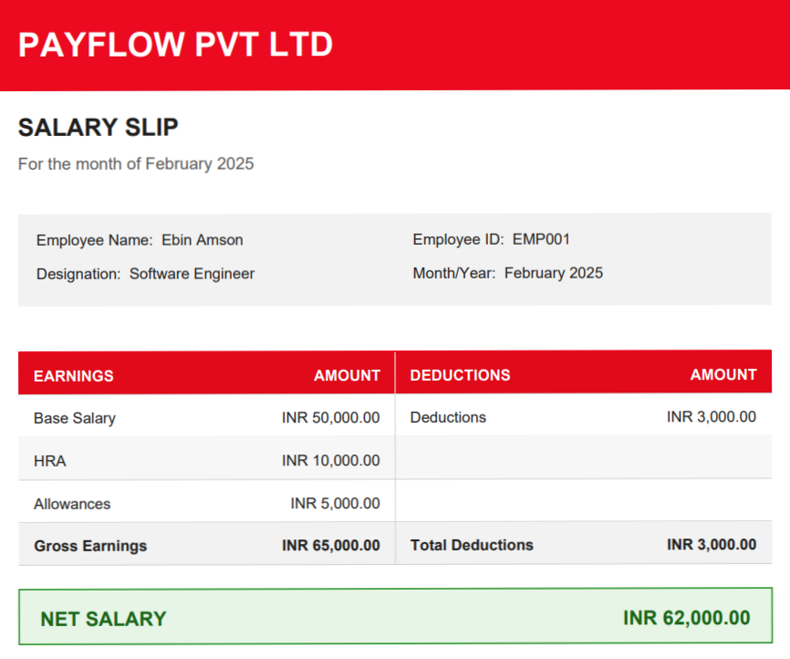
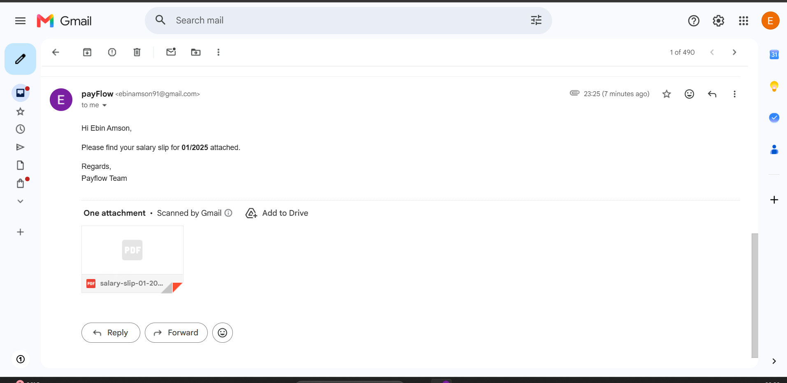

# Payflow Console

Payflow Console is a web application for employee salary slip automation. It lets an admin upload employee master data and monthly payroll files in CSV or Excel format, preview and validate the records, generate salary slip PDFs, and email each employee their slip automatically. The app also includes live dispatch status monitoring so the admin can track the progress of each run.

## Features

- Upload employee master data and monthly salary dispatch files using CSV or Excel.
- Preview uploaded data in a structured table before processing it.
- Validate required columns and highlight missing or invalid values early.
- Generate professional salary slip PDFs for each employee.
- Send salary slips automatically by email and monitor live dispatch status.
- Stream live dispatch progress with Server-Sent Events (SSE).
- Edit rows and columns directly in the preview table before dispatching.

## Tech Stack

- Next.js 16
- React 19
- TypeScript
- Tailwind CSS
- Supabase
- Nodemailer
- PDF generation with muhammara and pdf-lib
- XLSX parsing for spreadsheet uploads

## Architecture

This project follows a layered architecture:

- `app/` - Next.js app routes, pages, and UI components
- `app/api/` - Thin API routes for upload, validation, employee lookup, and dispatch
- `app/components/` - Presentation-focused React components
- `services/` - Business logic for dispatch, PDF generation, email, and employee handling
- `repositories/` - Database access layer
- `lib/` - Shared utilities and Supabase client setup
- `supabase/` - Database schema and SQL setup
- `public/` - Static assets, sample CSV files, and screenshots

### Directory Structure

```text
payflow/
├── app/
│   ├── api/
│   ├── components/
│   ├── globals.css
│   ├── layout.tsx
│   └── page.tsx
├── lib/
│   └── supabase/
├── repositories/
├── services/
├── supabase/
│   └── schema.sql
└── public/
	├── sample-csvs/
	└── screenshots/
```

## Local Installation

### Prerequisites

- Node.js 20 LTS recommended
- npm
- A Supabase project
- Gmail or another SMTP provider for email delivery

### 1. Clone the repository

```bash
git clone https://github.com/Ebin746/payflow.git
cd payflow
```

If you are not already in the project root, make sure you change into the root directory before continuing.

### 2. Install dependencies

```bash
npm install
```

### 3. Configure environment variables

Create a `.env.local` file in the project root and copy the values from `.env.local.example`:

```env
SUPABASE_URL=
SUPABASE_PUBLISHABLE_KEY=
SUPABASE_SECRET_KEY=

GMAIL_USER=
GMAIL_APP_PASSWORD=
EMAIL_FROM=
COMPANY_NAME=
```

Fill in all required values before running the app.

### 4. Set up the database

1. Create a new Supabase project.
2. Open the Supabase SQL editor.
3. Run the SQL file at `supabase/schema.sql` to create the required tables:
   - `employees`
   - `salary_records`

### 5. Start the development server

```bash
npm run dev
```

Then open the application at:

```text
http://localhost:3000
```

## Using the Application

- Use the sample data in `public/sample-csvs/` to test the workflow.
- The upload card in the app shows the expected column format for each file type.
- You can also download the dummy template files directly from the upload section.
- The app supports employee master uploads and monthly salary dispatch uploads.

### Expected Data

- Employee master upload: `employee_id`, `name`, `email`, `designation`
- Salary dispatch upload: `employee_id`, `base_salary`, `hra`, `allowances`, `deductions`, `month`, `year`

## Live Demo

Access the deployed version here:

https://payflow-console.vercel.app/

## Deployment

The application is deployed on Vercel and the live link above points to the production build.

For deployment, make sure the following are configured in the Vercel project settings:

- `SUPABASE_URL`
- `SUPABASE_PUBLISHABLE_KEY`
- `SUPABASE_SECRET_KEY`
- `GMAIL_USER`
- `GMAIL_APP_PASSWORD`
- `EMAIL_FROM`
- `COMPANY_NAME`

The Supabase database must also be created separately by running `supabase/schema.sql` in the SQL editor.

## Screenshots

### Home



### Upload Table



### Live Update



### PDF Example



### Email Notification



## Notes

- The app uses Supabase for structured data storage.
- Salary slips are generated dynamically and emailed to each employee as PDF attachments.
- Live dispatch monitoring helps the admin track progress, success, and failure status during processing.
- The dispatch UI uses SSE so the admin can see live status updates while processing runs.
- Uploaded rows can be edited in the preview grid before final confirmation.

## Database Tables

Payflow uses two main tables in Supabase:

### `employees`

Stores the employee master data that is used as the source of truth for dispatching salary slips.

| Column | Type | Description |
| --- | --- | --- |
| `employee_id` | `text` | Primary key. Unique identifier for each employee. |
| `name` | `text` | Employee full name. |
| `email` | `text` | Employee email address used for sending salary slips. |
| `designation` | `text` | Job title or role. |
| `birth_year` | `int` | Optional employee metadata. |

### `salary_records`

Stores the monthly salary information that is used to generate the PDF slip and compute the net salary.

| Column | Type | Description |
| --- | --- | --- |
| `id` | `bigint` | Primary key. Auto-generated row identifier. |
| `employee_id` | `text` | Foreign key referencing `employees.employee_id`. |
| `base_salary` | `numeric(12, 2)` | Base salary amount. |
| `hra` | `numeric(12, 2)` | House rent allowance. |
| `allowances` | `numeric(12, 2)` | Additional allowances. |
| `deductions` | `numeric(12, 2)` | Total deductions. |
| `month` | `int` | Payroll month. |
| `year` | `int` | Payroll year. |
| `net_salary` | `numeric(12, 2)` | Final calculated salary amount. |

### Relationships

- `employees.employee_id` is the primary key for the employee master table.
- `salary_records.employee_id` is a foreign key that references `employees.employee_id`.
- This relationship ensures that every salary record belongs to a valid employee.
- The app uses `employee_id` to look up employee details when processing monthly salary uploads.
- Deleting an employee is restricted if salary records already exist for that employee.

### Salary Calculation

The PDF generation flow uses the following formula:

```text
Net Salary = (Base Salary + HRA + Allowances) - Deductions
```

This value is stored in `salary_records.net_salary` and used in the generated salary slip PDF.

## API Routes

Payflow uses a small set of focused API routes to keep the upload and dispatch flow modular:

### `POST /api/upload`

- Parses the uploaded CSV or Excel file.
- Returns the column list, all parsed rows, and the total row count.
- Used immediately after a file is selected to build the preview table.

### `POST /api/employees/validate`

- Validates employee IDs against the employee master table.
- Returns only the missing employee IDs.
- Used before salary dispatch so invalid salary rows can be flagged early.

### `POST /api/employees/lookup`

- Fetches employee name and email details for a list of employee IDs.
- Also returns which IDs are missing from the database.
- Used to enrich salary rows with employee information in the preview table.

### `POST /api/employees`

- Upserts employee master rows into the `employees` table.
- Used when the admin uploads an employee master file.
- Confirms how many employee records were saved successfully.

### `POST /api/dispatch`

- Dispatches salary rows and returns the final dispatch result in JSON.
- Used when a non-streaming dispatch response is needed.
- Returns matched employees, inserted salary records, and row-level results.

### `POST /api/dispatch/stream`

- Streams dispatch progress as Server-Sent Events (SSE).
- Sends live `init`, `progress`, `complete`, and `error` events.
- Used by the UI to show real-time salary dispatch monitoring while emails and PDFs are processed.

### How the APIs Work Together

1. The user uploads a file through `POST /api/upload`.
2. The UI validates employee IDs with `POST /api/employees/validate` and enriches rows with `POST /api/employees/lookup` when needed.
3. Employee master uploads are saved through `POST /api/employees`.
4. Salary dispatch uses `POST /api/dispatch/stream` for live monitoring, or `POST /api/dispatch` for a standard JSON response.

## Future Enhancements

Planned improvements for scaling and reliability:

- Batch processing for large payroll files.
- Background job processing for PDF generation and email dispatch.
- Queue-based worker execution to support higher volume usage.
- Better retry handling and failure recovery for email delivery.
- More detailed audit logs for admin actions and dispatch history.

